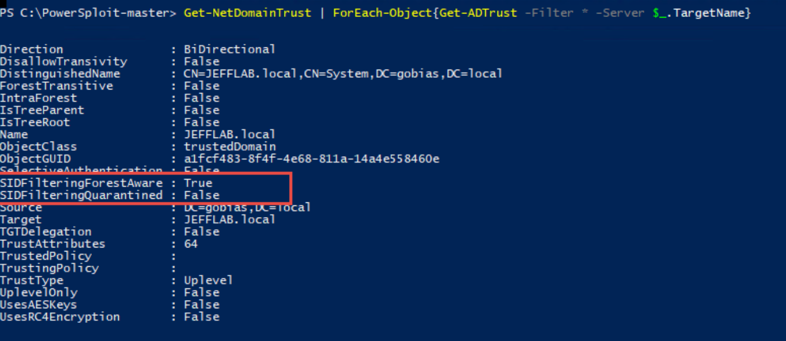
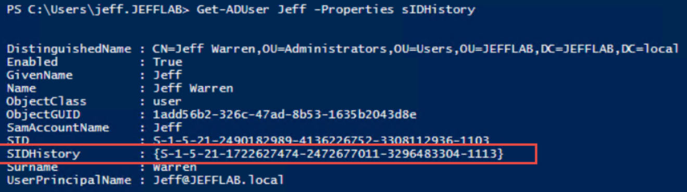
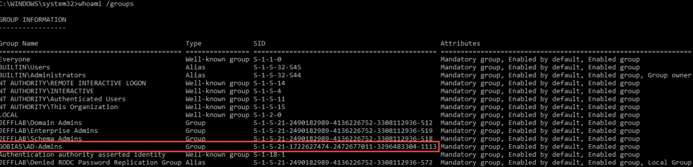
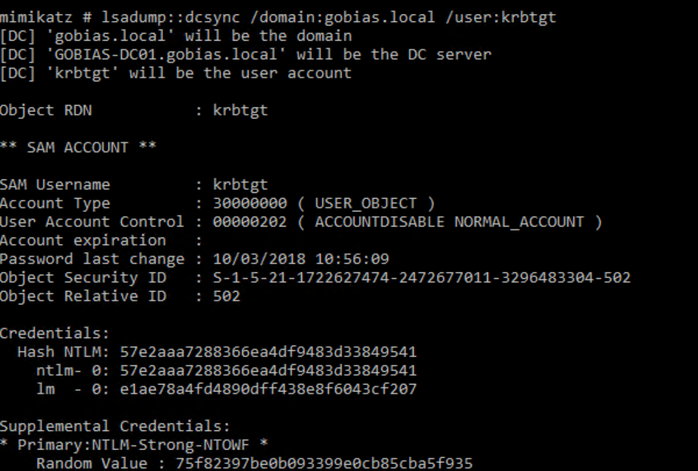
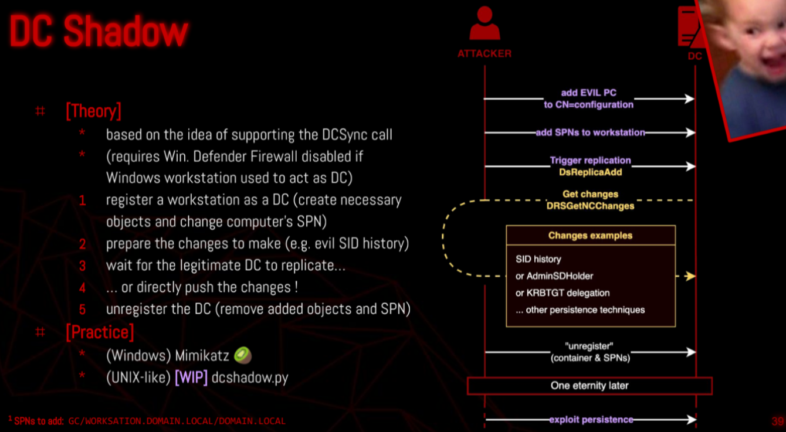

# DCShadow

The idea behind this persistence technique is to have an attacker-controlled machine act as a domain controller (shadow DC) to push changes onto the domain by forcing other domain controllers to replicate.

DCShadow to achieve persistence in a domain without detection once they’ve obtained admin credentials. But DCShadow can also enable an attacker to elevate their privileges.

### Step 1. Discover Trusts

The first step is to find out what trusts exist. There are several ways to do this, but two we will leverage through PowerShell are the PowerSploit framework and the Active Directory PowerShell module.

For each trust we find, we need to check whether SID filtering is enabled. If it is, then historical SIDs cannot be used to access the forest on the other side of the trust. However, if it is disabled, we are in business. Often this option is left disabled after migrations to ensure users don’t lose access to any systems and data they need. The following PowerShell command will discover trusts and enumerate their options, including SID filtering:

```
Get-NetDomainTrust | ForEach-Object{Get-ADTrust –filter * -server $_.TargetName}
```
The output of this command is provided below. You can see there is a trust to the gobias.local domain where SID filtering is disabled (SidFilteringQuarantined = False), so we will be able to use historical SIDs to access resources in that domain.




### Step 2. Elevate Privileges using SID History

We need to add an administrative SID to our user account so we can access resources in the trusted forest.
Using domain reconnaissance, we should be able to find a domain user or group which we want to add to our access token to gain elevated rights.

Let’s add the AD-Admins group from the gobias.local forest to our user account using the following DCShadow command:
```
lsadump::dcshadow /object:"CN=Jeff Warren,OU=Administrators,OU=Users,OU=JEFFLAB,DC=JEFFLAB,DC=local" /attribute:sidhistory /value:S-1-5-21-1722627474-2472677011-3296483304-1113
```

To see our newly added SIDhistory value, we can run the following script:

```
Get-ADUser Jeff -Properties sIDHistory
```



We can confirm this all worked by logging in again as this user and running a whoami /groups command to see the new group membership. Our user is only getting this group in its token through SID history.




### Step 3. Use the Elevated Privileges

After adding the historical SID to our user account, we are able to run the same command successfully and obtain the password hash to any account, including the extremely valuable krbtgt Kerberos service account.



